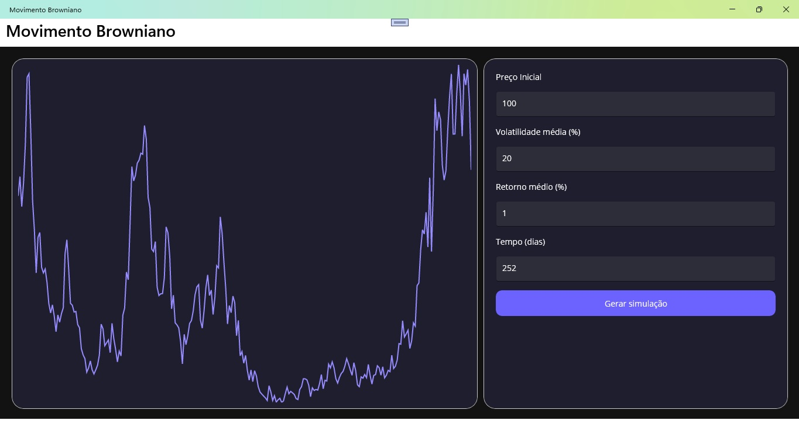

# Movimento Browniano

Aplicativo desenvolvido em .NET MAUI para simulação de Movimento Browniano.

### Pré-requisitos

- [.NET 9.0 SDK](https://dotnet.microsoft.com/download/dotnet/9.0) ou superior
- [Visual Studio 2022](https://visualstudio.microsoft.com/vs/) com carga de trabalho MAUI
- (Opcional) [Visual Studio Code](https://code.visualstudio.com/) com extensão C# Dev Kit

## Como Executar a Aplicação

### Usando o Visual Studio 2022

1.  Clone o repositório para sua máquina local:
    ```bash
    git clone https://github.com/gimidia/MauiBrownianMotion.git
    ```
2.  Navegue até o diretório do projeto.
3.  Abra o arquivo da solução `MauiBrownianMotion.sln` com o Visual Studio 2022.
4.  Aguarde o Visual Studio restaurar todas as dependências do projeto (NuGet packages).
5.  Selecione o dispositivo de destino na barra de ferramentas (ex: `Windows Machine` para rodar no Windows ou um emulador Android).
6.  Pressione **F5** ou clique no botão **▶ Iniciar** para compilar e executar a aplicação.

### Usando o Visual Studio Code

1.  Clone o repositório para sua máquina local.
2.  Abra a pasta raiz do projeto (`MauiBrownianMotion`) no Visual Studio Code.
3.  Abra um novo terminal no VS Code (**Terminal > New Terminal**).
4.  Navegue até o diretório do projeto:
    ```bash
    cd MauiBrownianMotion
    ```
5.  Limpe o projeto para remover artefatos de compilações anteriores (Opcional, mas recomendado):
    ```bash
    dotnet clean
    ```
6.  Restaure as dependências do projeto executando o comando:
    ```bash
    dotnet restore
    ```
7.  Compile o projeto:
    ```bash
    dotnet build
    ```
8.  Execute a aplicação para a plataforma desejada. Por exemplo, para Windows:
    ```bash
    dotnet build -t:Run -f net9.0-windows10.0.19041.0
    ```
    *Você pode encontrar os frameworks de destino disponíveis no arquivo `MauiBrownianMotion.csproj`.*


## Interface do Aplicativo



Este projeto é apenas para fins de estudo/demonstração.
