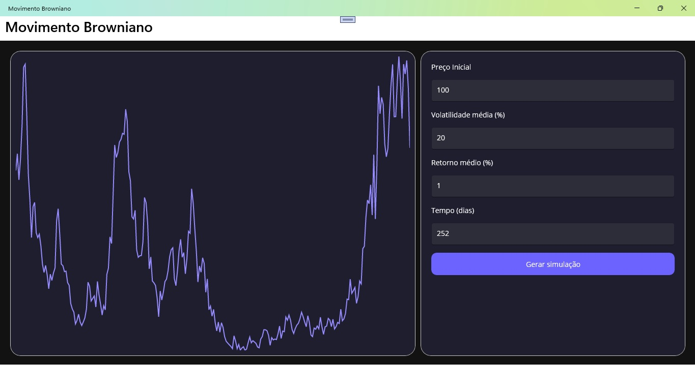

# Simulador de Movimento Browniano

Aplicativo Windows Desktop desenvolvido em .NET MAUI para simulação de Movimento Brownianos.

### Pré-requisitos

- [.NET 9.0 SDK](https://dotnet.microsoft.com/download/dotnet/9.0) ou superior
- [Visual Studio 2022](https://visualstudio.microsoft.com/vs/) com carga de trabalho MAUI
- (Opcional) [Visual Studio Code](https://code.visualstudio.com/) com extensão C# Dev Kit

### Instalação

1. Clone o repositório:
   ```bash
   git clone https://github.com/seuusuario/MauiBrownianMotion.git
   cd MauiBrownianMotion
   ```

2. Restaure os pacotes NuGet:
   ```bash
   dotnet restore
   ```

3. Execute o aplicativo:
   ```bash
   dotnet build -t:Run -f net9.0-windows10.0.19041.0
   ```
   Ou abra a solução no Visual Studio e execute a partir dele.


## Plataforma Suportada

- Windows Desktop (versão 10/11)

## Interface do Aplicativo



Este projeto é apenas para fins de estudo/demonstração.
